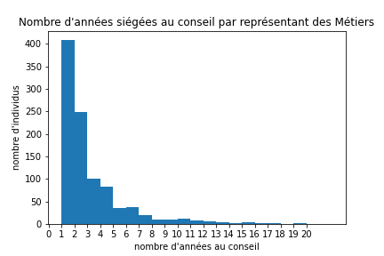

# L'échevinat des métiers strasbourgeois
Prosopographie numérique, extraction et réconciliation de données, analyse de classe.

# Table des matières

1. [Démarche et Problématiques](#DémarcheProblématiques)
    1. [Définition](#Définition)
    2. [Problématique](#Problématique)
2. [Acquisition des données](#Acquisition)
    1. [Présentation des Sources](#Présentation)
    2. [Transcription](#Transcription)
    3. [Encodage XML](#Encodage)
    4. [Normalisation](#Normalisation)
    5. [Parsing](#Parsing)
4. [Traitement des données](#Traitement)
5. [Analyse de Réseau](#NetworkAnalysis)
    1. [Création du jeu de données](#Creation)
7. d

## Démarche et Problématiques
### Définition
L'échevin strasbourgeois était à l'origine un office attribué par l'évêque à des notables strasbourgeois pour l'assister à gouverner la ville dont il était le seigneur. L'office était attribué à vie et non héréditaire.
L'émancipation de la communauté des bourgeois vis-à-vis de son seigneur temporel et la reconnaissance de son statut de ville libre par l'empereur transformèrent profondément le paysage institutionnel de la ville. Elle dut se doter d'un appareil institutionnel permettant aux bourgeois de gouverner leur ville. Les constitutions successivent (*Schwörbriefe*) et leurs différences permettent de détailler l'évolution des rapports de force au sein de la société urbaine. Aux lignages nobles urbains qui assurèrent initialement le gouvernement de la ville suite à l'éviction de l'évêque succèdent les patriciens non-nobles (financiers et grands marchands). Après un nouvel épisode de violences urbaines en 1349, les bourgeois des Métiers constitués en corporations professionnelles et politiques confisquent définitivement le pouvoir aux patriciens.

Il est impossible de discocier l'office d'échevin du système des corporations (*Zünfte*), qui organise la vie politique de la ville libre, et de la magistrature d'ammeistre (*magister scabinorum* ou *Ammeister*), qui détient le pouvoir exécutif, tant ces agents institutionnels participent à rendre unique le gouvernement de la ville de Strasbourg.
L'ammeistre qui occupe jusqu'en 1349 un rôle secondaire au sein de l'appareil institutionnel est promu à la tête du gouvernement.
Nommé annuellement parmi les bourgeois des métiers il gouverne la ville au côté de quatre stettmeistres qui se succèdent trimestriellement. L'échevinat qui n'était occupé que par des patriciens s'ouvre aux Métiers dans les années 1330. Il se développe dans la seconde moitié du XIVe siècle jusqu'à dépasser en nombre l'échevinat patricien. Les échevins exercent leurs fonctions judiciaires principalement dans le cadre du tribunal corporatif où ils arbitrent les affaires professionnelles et les conflits entre membres.
L'échevinat des Métiers acquiert à Strasbourg plusieurs fonctions politiques qui lui sont spécifiques. Lorsqu'une décision difficle doit être prise par l'ammeistre, il peut convoquer et consulter l'assemblée des échevins afin de délibérer avec eux. L'échevinat (*Schöffel und Amman*) est l'instance de représentation la plus étendue des bourgeois de la ville et permet avec l'aval de la majorité d'entre eux de prendre une décision difficile sans mettre en danger l'ordre et l'équilibre de la ville (exemple consultation des échevins).

Les échevins acquièrent de nouvelles prérogatives en 1433. La nouvelle constitution prévoit une augmentation du nombre d'échevins jusqu'à ce qu'on en compte 15 par corporation. Les échevins de chaque corporation doivent désormais élire leur représentant au conseil parmis leurs pairs.
Nous avons pu toutefois constater que cette mesure était encore loin d'être appliquée plus d'une décennie après la promulgation de la constitution de 1433. Les échevins étaient au nombre de 381 et étaient très inégalement répartis entre les corporations.
Dans un effort continu de rationnalisation de son système institutionnel, la ville réduit le nombre de corporation à trois reprises (1462, 1470 et 1482). Les membres d'une corporation supprimée intègrent une autre corporation ou sont répartis entre plusieurs d'entre elles. On peut imaginer qu'il en va de même pour les échevins puisque leur nombre au des corporations les moins importantes augmente progressivement au cours de la seconde moitié du XVe siècle jusqu'à atteindre 15 alors que les collèges échevinaux des corporations les plus importantes se réduisent à 15.

### Problématique
L'évolution institutionnelle de l'office d'échevin a été étudié en détail dans le cadre des études sur l'organisation politique, sociale et institutionnelle de la ville libre, mais toujours par le prisme des textes de loi. Nous souhaitons aborder le groupe social constitué par les échevins par le bas en en proposant une prosopographie. Nous allons analyser les sources à notre disposition afin d'identifier les fonctions tacites de l'échevinat et les dynamiques internes aux collèges échinaux corporatifs.

En d'autres termes, nous souhaitons mieux comprendre comment l'échevinat s'intègre à la société strasbourgeoise médiévale. Tous les échevins finissent-ils par briguer les plus hautes magistratures du système institutionnel strasbourgeois ? L'ascension politique concerne-t-elle une majorité des échevins, ou au contraire seulement une minortié d'entre eux ? Existe-t-il une discrimination entre les carrières des échevins selon leur métier et leur corporation ?

Aucune source sérielle documentant l'identité des échevins de chaque corporation ne nous est parvenue. Peu de sources permettent de documenter les identités de la totalités des échevins de Strasbourg pour une date donnée. Nous allons nous intéresser aux échevins et à ceux d'entre eux qui accédèrent à des magistratures supérieures : représentants au conseil des corporations et ammeistres.

## Acquisition des données
### Présentation des sources
Nous avons exploité deux sources principales. La première source est le premier livre de bourgeoisie ; il liste chaque année les étrangers ayant acquis le droit de bourgeoisie par achat ou par mariage. Les listes des membres du conseil (grand Sénat) de Strasbourg ont été recopiée au début du registre au cours du XVe siècle. Pour chaque année, les listes énumèrent nominalement l'ammeistre, les stettmeistres, les conseillers des constaffel et les conseillers des corporations. Ces listes ont fait l'objet d'une édition et d'une indéxation par Jacques Hatt en 1963. Très utile, cette édition documente les membres du conseil jusqu'en 1603, mais en raison du très grand nombre de magistrats mentionnés, le travail de réconciliation manuel des occurences en autorité a souffert de quelques erreurs. Ces listes nous permettent de créer un référentiel contenant l'identité de tous les échevins ayant exercé une magistrature au conseil .

Notre seconde source est une liste d'armement datée de 1444. Ces listes nomment tous les bourgeois dans l'obligation de participer à l'effort de guerre, en servant sous les bannières ou en fournissant du matériel et un remplaçant. Elle liste tous les échevins des métiers, par corporation.

Croiser ces deux documents en identifiant les individus nommés nous permettrait d'analyser l'évolution des carrières de chaque échevin mentionné en 1444 dans le temps, avant et après.

### Transcription

J'envisageais au départ d'employer la technologie HTR de [Kraken](http://kraken.re/master/index.html) via [Escriptorium](https://gitlab.inria.fr/scripta/escriptorium) pour transcrire automatiquement mon corpus. Cependant, en raison de la pluralité des mains et du volume documentaire restreint disponible pour chacune d'elles rendent, investir du temps à entrainer un modèle par main, ou un modèle multimain aurait été contre-productif.

Nous avons donc procédé à la transcription des 100 listes du conseil (1400-1499) et des listes d'armement des échevins des métiers (1444) manuellement. Nous avons transcrit l'intégralité des liste du conseil dans une perspective de données ouverte et de réutilisation. Nous avons choisi de développer les abbréviations et de ne pas normaliser la graphie des mots, pourtant marquée fortement pas les géolectes et les idiolectes. Dans un contexte orthographique à géométrie variable, nous avons choisi de repousser la normalisation des noms de nos échevins à une étape ultérieure. Normaliser dès la transcription un texte sujet à la trascription automatique et donc fortement inféodé aux idiolectes et géolectes de l'auteur augmente fortement les risques d'erreur et de faux négatif lors de la réunion des différentes mentions du même échevin en une autorité.

### Encodage XML
Le but premier de l'encodage des documents est d'en extraire toutes les informations prosopographiques disponibles.
Nous avons ensuite encodé notre document en XML en reprenant des balises de la grammaire développée par le consortium [TEI](https://tei-c.org/).
La traçabilité des informations collectées est assurée par un premier jeu de balises mobilisé afin d'accéder aux métadonnées relatives à chaque mention d'échevin. Ces métadonnées permettent de localiser l'information dans la source.

| balise | contenu                           | attributs                   |
| ------ | --------------------------------- | --------------------------- |
| [pb](https://tei-c.org/release/doc/tei-p5-doc/fr/html/ref-pb.html)     | nouvelle page                     | n(nombre)                   |
| [cb](https://tei-c.org/release/doc/tei-p5-doc/fr/html/ref-cb.html)     | nouvelle colonne                  | n(nombre)                   |
| [lb](https://tei-c.org/release/doc/tei-p5-doc/fr/html/ref-lb.html)     | nouvelle ligne                    | n(nombre)                   |
| [p](https://tei-c.org/release/doc/tei-p5-doc/fr/html/ref-p.html)      | paragraphe                        |                             |

Un second jeu de balises encode les données relatives aux informations prosopographiques disponibles dans les sources pour chaque individu. Elles concernent l'anthroponymie, mais également de l'appartenance professionnelle, sociale et politique de l'individu.

| balise   | contenu                           | attributs                   |
| -------- | --------------------------------- | --------------------------- |
| [div](https://tei-c.org/release/doc/tei-p5-doc/fr/html/ref-div.html)      | nouveau sous ensemble d’individus | type(sous-ensemble), n(nom) |
| [persname](https://tei-c.org/release/doc/tei-p5-doc/fr/html/ref-persname.html) | nom complet                       |                             |
| [forename](https://tei-c.org/release/doc/tei-p5-doc/fr/html/ref-forename.html) | prénom                            |                             |
| [surname](https://tei-c.org/release/doc/tei-p5-doc/fr/html/ref-surname.html)  | nom de famille                    |                             |
| [genName](https://tei-c.org/release/doc/tei-p5-doc/fr/html/ref-genName.html)  | surnom générationnel              |                             |
| [addName](https://tei-c.org/release/doc/tei-p5-doc/fr/html/ref-addName.html)   | surnom                            |                             |

### Normalisation
L'irrégularité des anthroponymes due à l'absence d'orthographe est un problème récurent pour tout historien s'intéressant aux langues vernaculaires.
Nous avons constitué des référentiels au format csv contenant au minimum un dictionnaire dont la clé est la forme normalisée et la valeur une liste des formes rejetées.
Nous avons rédigé deux scripts qui permettent de les enrichir à partir de documents xml qui comportent des balises contenant des formes rejetées.
Le [premier](./Referentiels/EnrichissementCsvPrenom.ipynb) permet de créer un [référentiel](./Referentiels/ReferentielPrenoms.csv) pour les prénoms.
Le référentiel des prénoms propose pour chaque forme normalisée, la traduction française, un essai de typologie ainsi que la liste des formes rejetées.

| **PrénomNormalisé** | **PrénomFrançais** | **Types**                | **FormesNonNormalisées**                                                                                       |
| ------------------- | ------------------ | ------------------------ | -------------------------------------------------------------------------------------------------------------- |
| adalhelm            | alleaume           | \['masc', 'germanique'\] | \['adalhelm', 'adelhelm', 'alhelm'\]                                                                           |
| adam                | adam               | \['masc', 'hébraïque'\]  | \['adam'\]                                                                                                     |
| anthenie            | antoine            | \['masc', 'latin'\]      | \['anthenie', 'anthenig', 'anthenye', 'anthenige', 'anthonie', 'anthonye', 'anthenÿe', 'anthonÿe', 'thenige'\] |
| arbogast            |                    | \['masc', 'germanique'\] | \['arbgast', 'arbogast', 'ärbgäst'\]                                                                           |

Le [second](./Referentiels/EnrichissementCsvNoms.ipynb) permet de créer un [référentiel](./Referentiels/ReferentielNoms.csv) pour les nom et les surnoms. Pour chaque forme normalisée il propose un essai de typologie, une liste des formes rejetées, et dans le cas d'un nom toponymique, le nom du lieu auquel le nom fait référence lorsqu'il est connu.

| **NomNormalisé** | **Types**        | **FormesNonNormalisées**              | **RenvoiToponymique** |
| ---------------- | ---------------- | ------------------------------------- | --------------------- |
| aarau, von       | \['toponymic'\]  | \['von arowe', 'aarau, von'\]         | Aarau                 |
| achenheim        | \['toponymic'\]  | \['achenheim'\]                       | Achenheim             |
| achenheim, von   | \['toponymic'\]  | \['von achenheim', 'achenheim, von'\] | Achenheim             |
| achtjahre        | \['cognominal'\] | \['acht jore', 'achtjahre'\]          |                       |
| acker            | \['cognominal'\] | \['acker', 'ackel'\]                  |                       |

Le choix des formes normalisées est empirique et tente d'harmoniser au mieux la graphie tout en restant le plus proches de la forme dominante.
Il repose donc sur des choix qui nous sont personnels et peuvent être discutés, mais permettent en l'état de travailler plus efficacement nos données dans les étapes suivantes de notre projet.

Les enrichissements relatifs à la typologie, à la traduction et aux renvois toponymiques ont été réalisés dans le but de faciliter la réutilisation des référentiels à diverses fins, par exemple une analyse des renvois toponymiques des noms de la totalité ou d'un sous-ensemble donnée de la population strasbourgeoise médiévale.

### Parsing
Nous avons élaboré un [script python](./Analyse/AnalyseListesConseil.ipynb) pour extraire les données relatives à chaque occurence d'individu.
Notre script compare notamment les formes rejetées des anthroponymes avec nos fichiers référentiels pour en tirer la forme normalisée.
Nous avons utilisé le module [Beautiful Soup (BS4)](https://www.crummy.com/software/BeautifulSoup/bs4/doc/) pour parser notre document. Il est équipé du parseur [lxml](https://lxml.de/) et plus adapté aux documents irréguliers que ce dernier.
Il produit en sortie un [fichier csv](./Sources/ListesConseil) par année.
Ces fichiers contiennent le rang de l'individu au conseil de l'année donnée, l'identifiant temporaire attribué à l'occurence, l'année de la magistrature, la magistrature exercée, l'occurence, le prénom normalisé, le nom normalisé, le surnom, le surnom générationnel, les titres et rôles, le corps civique, le poêle, la page, la colonne et la ligne de la mention.
Ce sont des éditions des listes du conseil au format csv.

| **Unnamed: 0** | **id**                   | **anneeMagistrature** | **magistrature**            | **occurence**                      | **prenom** | **nom**     | **surnom**     | **genName** | **titres\_roles**      | **corps civique** | **corporation**              | **poele** | **page** | **colonne** | **ligne** |
| -------------- | ------------------------ | --------------------- | --------------------------- | ---------------------------------- | ---------- | ----------- | -------------- | ----------- | ---------------------- | ----------------- | ---------------------------- | --------- | -------- | ----------- | --------- |
| 5              | aves\_aa\_4R\_1400\_0005 | 1400                  | ammeister                   | her Wilhelm Metziger der ammeister | wilhelm    | metziger    |                |             | \['her', 'ammeister'\] | echevinat         |                              |           | 131      | 1           | 5         |
| 30             | aves\_aa\_4R\_1400\_0030 | 1400                  | conseiller\_des\_marchands  | Hanman von Colmar                  | hannemann  | colmar, von |                |             |                        | echevinat         | corporation\_des\_marchands  |           | 131      | 1           | 30        |
| 31             | aves\_aa\_4R\_1400\_0031 | 1400                  | conseiller\_des\_boulangers | Gerung inn Judengasse              |            | gerung      | judengasse, in |             |                        | echevinat         | corporation\_des\_boulangers |           | 131      | 1           | 31        |
| 32             | aves\_aa\_4R\_1400\_0032 | 1400                  | conseiller\_des\_bouchers   | Wilhelm Rotschilt                  | wilhelm    | rotschilt   |                |             |                        | echevinat         | corporation\_des\_bouchers   |           | 131      | 1           | 32        |

## Traitement des données
À partir de ces fichiers csv, nous avons compilé à l'aide d'un autre [script](./Analyse/CompilationEchevins.ipynb) toutes les occurences relatives aux différents représentants des Métiers (conseillers des corporations et ammeistres) en un seul [fichier csv](./Analyse/Data/OccEch.csv ).
Nous avons utilisé le module python [Jellyfish](https://pypi.org/project/jellyfish/), qui propose plusieurs algorithme permettant de calculer la distance ou la similarité entre des chaînes de caractères sur des chaînes de caractères.
Nous avons comparé une colonne de notre tableau avec elle-même (la concaténation du nom et du prénom normalisé) et généré plusieurs matrices de similarité et de distance à l'aide s'un [script](./Analyse/Recon.ipynb) python.
Il serait possible d'améliorer ce script en ne générant que la moitié de la matrice en excluant la diagonale principale.
Nous avons décidé d'employer la [distance de Jaro-Winkler](https://fr.wikipedia.org/wiki/Distance_de_Jaro-Winkler) car elle s'avère particulièrement bien adaptée au traitement de noms et de chaînes de caractères courtes de manière générale.

|s_{i}| est la longueur de la chaîne de caractères s i {\displaystyle s_{i}} s_{i} ;

À partir de cette matrice, nous créons grâce à un [script](./Analyse/Matrixeconciliation.ipynb) un tableur de réconciliation où nous réunissons les identifiants temporaires des occurences par autorité identifiée.
À partir de ce tableur, nous avons extrait les informations relatives à chaque occurence et nous les avons mises en série dans une seule ligne d'un tableur dédié aux autorités.

| Recid                    | subid                                                                                                                                                                      | Unnamed: 0              | anneeMagistrature                      | magistrature                                                                                                                                        | occurence                                                                                                                                                                                    | prenom                                                               | nom                                                                        | surnom                           | genName                          | titres\_roles                                                                                                           | corps\_civique                                                                   | corporation                                                                                                                                              | poele                            | page                             | colonne                          | ligne                   | AuthNameForename       | Length |
| ------------------------ | -------------------------------------------------------------------------------------------------------------------------------------------------------------------------- | ----------------------- | -------------------------------------- | --------------------------------------------------------------------------------------------------------------------------------------------------- | -------------------------------------------------------------------------------------------------------------------------------------------------------------------------------------------- | -------------------------------------------------------------------- | -------------------------------------------------------------------------- | -------------------------------- | -------------------------------- | ----------------------------------------------------------------------------------------------------------------------- | -------------------------------------------------------------------------------- | -------------------------------------------------------------------------------------------------------------------------------------------------------- | -------------------------------- | -------------------------------- | -------------------------------- | ----------------------- | ---------------------- | ------ |
| aves\_aa\_4R\_auth\_0001 | \['aves\_aa\_4R\_1400\_0005', 'aves\_aa\_4R\_1402\_0031', 'aves\_aa\_4R\_1404\_0005', 'aves\_aa\_4R\_1406\_0005', 'aves\_aa\_4R\_1408\_0032', 'aves\_aa\_4R\_1410\_0032'\] | \[5, 31, 5, 5, 32, 32\] | \[1400, 1402, 1404, 1406, 1408, 1410\] | \['ammeister', 'conseiller\_des\_bouchers', 'ammeister', 'ammeister', 'conseiller\_des\_bouchers', 'conseiller\_des\_bouchers'\]                    | \['her Wilhelm Metziger der ammeister', 'her Wilhelm Metziger', 'her Wilhelm Metziger der ammeister', 'her Wilhelm Metziger der ammeister', 'her Wilhelm Metziger', 'her Wilhelm Metziger'\] | \['wilhelm', 'wilhelm', 'wilhelm', 'wilhelm', 'wilhelm', 'wilhelm'\] | \['metziger', 'metziger', 'metziger', 'metziger', 'metziger', 'metziger'\] | \[nan, nan, nan, nan, nan, nan\] | \[nan, nan, nan, nan, nan, nan\] | \["\['her', 'ammeister'\]", "\['her'\]", "\['her', 'ammeister'\]", "\['her', 'ammeister'\]", "\['her'\]", "\['her'\]"\] | \['echevinat', 'echevinat', 'echevinat', 'echevinat', 'echevinat', 'echevinat'\] | \[nan, 'corporation\_des\_bouchers', nan, nan, 'corporation\_des\_bouchers', 'corporation\_des\_bouchers'\]                                              | \[nan, nan, nan, nan, nan, nan\] | \[131, 133, 135, 137, 139, 141\] | \[1.0, 1.0, 1.0, 1.0, 1.0, 1.0\] | \[5, 31, 5, 5, 32, 32\] | metziger, wilhelm      | 6      |
| aves\_aa\_4R\_auth\_0002 | \['aves\_aa\_4R\_1400\_0030'\]                                                                                                                                             | \[30\]                  | \[1400\]                               | \['conseiller\_des\_marchands'\]                                                                                                                    | \['Hanman von Colmar'\]                                                                                                                                                                      | \['hannemann'\]                                                      | \['colmar, von'\]                                                          | \[nan\]                          | \[nan\]                          | \[nan\]                                                                                                                 | \['echevinat'\]                                                                  | \['corporation\_des\_marchands'\]                                                                                                                        | \[nan\]                          | \[131\]                          | \[1.0\]                          | \[30\]                  | colmar, von, hannemann | 1      |
| aves\_aa\_4R\_auth\_0003 | \['aves\_aa\_4R\_1400\_0031'\]                                                                                                                                             | \[31\]                  | \[1400\]                               | \['conseiller\_des\_boulangers'\]                                                                                                                   | \['Gerung inn Judengasse'\]                                                                                                                                                                  | \[''\]                                                               | \['gerung'\]                                                               | \['judengasse, in'\]             | \[nan\]                          | \[nan\]                                                                                                                 | \['echevinat'\]                                                                  | \['corporation\_des\_boulangers'\]                                                                                                                       | \[nan\]                          | \[131\]                          | \[1.0\]                          | \[31\]                  | gerung,                | 1      |
| aves\_aa\_4R\_auth\_0004 | \['aves\_aa\_4R\_1400\_0032'\]                                                                                                                                             | \[32\]                  | \[1400\]                               | \['conseiller\_des\_bouchers'\]                                                                                                                     | \['Wilhelm Rotschilt'\]                                                                                                                                                                      | \['wilhelm'\]                                                        | \['rotschilt'\]                                                            | \[nan\]                          | \[nan\]                          | \[nan\]                                                                                                                 | \['echevinat'\]                                                                  | \['corporation\_des\_bouchers'\]                                                                                                                         | \[nan\]                          | \[131\]                          | \[1.0\]                          | \[32\]                  | rotschilt, wilhelm     | 1      |
| aves\_aa\_4R\_auth\_0005 | \['aves\_aa\_4R\_1400\_0033', 'aves\_aa\_4R\_1406\_0033', 'aves\_aa\_4R\_1410\_0033', 'aves\_aa\_4R\_1418\_0033', 'aves\_aa\_4R\_1422\_0020'\]                             | \[33, 33, 33, 33, 20\]  | \[1400, 1406, 1410, 1418, 1422\]       | \['conseiller\_des\_drapiers', 'conseiller\_des\_drapiers', 'conseiller\_des\_drapiers', 'conseiller\_des\_drapiers', 'conseiller\_des\_drapiers'\] | \['Claus Spilman', 'Claus Spilman', 'Claus Spilman', 'Claus Spilman', 'Claus Spilman'\]                                                                                                      | \['claus', 'claus', 'claus', 'claus', 'claus'\]                      | \['spielmann', 'spielmann', 'spielmann', 'spielmann', 'spielmann'\]        | \[nan, nan, nan, nan, nan\]      | \[nan, nan, nan, nan, nan\]      | \[nan, nan, nan, nan, nan\]                                                                                             | \['echevinat', 'echevinat', 'echevinat', 'echevinat', 'echevinat'\]              | \['corporation\_des\_drapiers', 'corporation\_des\_drapiers', 'corporation\_des\_drapiers', 'corporation\_des\_drapiers', 'corporation\_des\_drapiers'\] | \[nan, nan, nan, nan, nan\]      | \[131, 137, 141, 149, 153\]      | \[1.0, 1.0, 1.0, 1.0, 1.0\]      | \[33, 33, 33, 33, 20\]  | spielmann, claus       | 5      |

Lors de la première projection de notre réseau nous avons constaté la présence de faux-positifs.
Nous avons donc réalisé deux petites fonctions qui permettent de détecter les faux-négatifs en se basant sur les noms et les faux-positifs en se basant sur les différentes magistratures exercées par un individu.
Il faut toutefois veiller à utiliser le déctecteur de faux négatifs avant le détecteur de faux-positifs, sans quoi le script détectera toutes les autorités déjà corrigées.

## Analyse de réseau
### Création du jeu de données
Pour créer un jeu de données analysable à l'aide de la théorie des graphes, il faut générer deux tableurs : un tableur de liens (*edges*) et un tableur de noeuds (*summits*).
Pour ce faire nous avons commencé par générer le tableur de liens à partir de notre tableur d'autorités.
Pour chaque autorité, nous créons un lien avec chaque conseil au sein duquel elle fut magistrat.

| Recid                    | subid                                                                                                                                                                      | Unnamed: 0              | anneeMagistrature                      | magistrature                                                                                                                                        | occurence                                                                                                                                                                                    | prenom                                                               | nom                                                                        | surnom                           | genName                          | titres\_roles                                                                                                           | corps\_civique                                                                   | corporation                                                                                                                                              | poele                            | page                             | colonne                          | ligne                   | AuthNameForename       | Length |
| ------------------------ | -------------------------------------------------------------------------------------------------------------------------------------------------------------------------- | ----------------------- | -------------------------------------- | --------------------------------------------------------------------------------------------------------------------------------------------------- | -------------------------------------------------------------------------------------------------------------------------------------------------------------------------------------------- | -------------------------------------------------------------------- | -------------------------------------------------------------------------- | -------------------------------- | -------------------------------- | ----------------------------------------------------------------------------------------------------------------------- | -------------------------------------------------------------------------------- | -------------------------------------------------------------------------------------------------------------------------------------------------------- | -------------------------------- | -------------------------------- | -------------------------------- | ----------------------- | ---------------------- | ------ |
| aves\_aa\_4R\_auth\_0001 | \['aves\_aa\_4R\_1400\_0005', 'aves\_aa\_4R\_1402\_0031', 'aves\_aa\_4R\_1404\_0005', 'aves\_aa\_4R\_1406\_0005', 'aves\_aa\_4R\_1408\_0032', 'aves\_aa\_4R\_1410\_0032'\] | \[5, 31, 5, 5, 32, 32\] | \[1400, 1402, 1404, 1406, 1408, 1410\] | \['ammeister', 'conseiller\_des\_bouchers', 'ammeister', 'ammeister', 'conseiller\_des\_bouchers', 'conseiller\_des\_bouchers'\]                    | \['her Wilhelm Metziger der ammeister', 'her Wilhelm Metziger', 'her Wilhelm Metziger der ammeister', 'her Wilhelm Metziger der ammeister', 'her Wilhelm Metziger', 'her Wilhelm Metziger'\] | \['wilhelm', 'wilhelm', 'wilhelm', 'wilhelm', 'wilhelm', 'wilhelm'\] | \['metziger', 'metziger', 'metziger', 'metziger', 'metziger', 'metziger'\] | \[nan, nan, nan, nan, nan, nan\] | \[nan, nan, nan, nan, nan, nan\] | \["\['her', 'ammeister'\]", "\['her'\]", "\['her', 'ammeister'\]", "\['her', 'ammeister'\]", "\['her'\]", "\['her'\]"\] | \['echevinat', 'echevinat', 'echevinat', 'echevinat', 'echevinat', 'echevinat'\] | \[nan, 'corporation\_des\_bouchers', nan, nan, 'corporation\_des\_bouchers', 'corporation\_des\_bouchers'\]                                              | \[nan, nan, nan, nan, nan, nan\] | \[131, 133, 135, 137, 139, 141\] | \[1.0, 1.0, 1.0, 1.0, 1.0, 1.0\] | \[5, 31, 5, 5, 32, 32\] | metziger, wilhelm      | 6      |

Dans le cas de Wilhelm Metziger (aves\_aa\_4R\_auth\_0001), conseiller des boucher et ammeistre, nous avons créé 6 liens, un avec chaque conseil auquel il siégea : 1400, 1402, 1404, 1406, 1408, 1410.
Nous obtenons le [tableur](./Analyse/AnalyseRéseau/Data/edge.csv) suivant :

| Source                   | Target | nature\_lien | label             |
| ------------------------ | ------ | ------------ | ----------------- |
| aves\_aa\_4R\_auth\_0001 | 1400   | ammeister    | metziger, wilhelm |
| aves\_aa\_4R\_auth\_0001 | 1402   | conseiller   | metziger, wilhelm |
| aves\_aa\_4R\_auth\_0001 | 1404   | ammeister    | metziger, wilhelm |

En ouvrant cette table des liens avec le logiciel [gephi](https://gephi.org/), nous pouvons exporter la table des noeuds, puis l'enrichir.

| Id                       | Label                  | type     | corporation                 |
| ------------------------ | ---------------------- | -------- | --------------------------- |
| 1400                     | 1400                   | annee    |                             |
| aves\_aa\_4R\_auth\_0001 | metziger, wilhelm      | personne | corporation\_des\_bouchers  |
| aves\_aa\_4R\_auth\_0002 | colmar, von, hannemann | personne | corporation\_des\_marchands |

Nous pouvons dès lors générer un réseau à partir duquel il est possible de travailler.
Il s'agit d'un réseau biparti qui représente les liens entre les conseillers et ammeistres (nos échevins) et les instances annuelles du conseil.
Voici la projection du réseau avant traitement :

Nous avons réduit la dimensionalité de notre graphe à l'aide d'un module gephi [MultiMode Projections](https://github.com/jaroslav-kuchar/Multimode-Networks).
Le réseau ne représente désormais plus les liens entre les échevins présents au conseil et les instances de celui-ci, mais les liens entre tous les échevins des Métiers ayant siégés simultanément au conseil de la ville. Nous sommes passés d'un graphe biparti à un graphe monoparti.

Après avoir appliqué à notre réseau un algorithme de projection (ici *Force Atlas 2*), il adopte une forme allongée. Ce phénomène est logique puisque notre réseau s'inscrit dans le temps long.
En calculant les classes de modularité les plus grandes possibles de notre réseau, elles sont au nombre de 4 et correspondent aux quarts de siècles.

Les échevins sont plus nombreux à siéger au conseil au début qu'à la fin du siècle.
Nous constatons une première décroissance du nombre d'échevins siégeant au conseil au milieu de notre graphe.
En effet, le conseil de Strasbourg décide en 1456 de nommer les conseillers biannuellement pour remédier aux inconvénients de la nomination annuelle.
Les conseillers des corporations les moins prestigieuses avaient parfois du mal à se rendre disponibles pour se rendre aux séances (cf. principe de disponibilité, Max Weber).
La rotation de l'effectif complet représentait forcément une rupture dans la continuité institutionnelle.
Après 1456, ce sont chaque année la moitié des corporations qui élisent de nouveaux représentants ; ceux des corporations restantes, élus l'année précédente, assurant la continuité du conseil.

## Bibliographie
### Monographies et articles scientifiques
- ALIOTH Martin, *Gruppen an der Macht : Zünfte und Patriziat in Strassburg im 14. und 15. Jahrhundert : Untersuchungen zu Verfassung, Wirtschaftsgefüge und Sozialstruktur*, Helbing Lichtenhahn, Basel, 1988.
- ALVAREZ-ALTMAN Grace, « Literary Onomastics Typology : Analytic Guidelines to Literary Onomastics Studies », dans *Literary Onomastics Studies*, 8, art. 21, 1981, URL : https://digitalcommons.brockport.edu/los/vol8/iss1/21/?utm_source=digitalcommons.brockport.edu (page consultée le 7 mai 2021).
- BUCHHOLZER Laurence & LACHAUD Frédérique, « Le serment dans les villes du bas Moyen Âge », dans *Histoire urbaine*, 39 1, mai 2014, pp. 7-27.
- BRADLEY John, « Documents and Data : Modelling Materials for Humanities Research in XML and Relational Databases », dans *Literary and Linguistic Computing*, 20 1, mars 2005, pp. 133-151, URL : https://doi.org/10.1093/llc/fqh048.
- CORNELL Jackson, « Use of Social Network Analysis to Explore the People of Medieval Scotland », dans *Digital Scholarship in the Humanities*, 32 2, 2016, DOI : https://doi.org/10.1093/llc/fqv070 (page consultée le 25 avril 2021).
- CRAEMER Ulrich, *Die Verfassung und der Verwaltung Strassburgs von der Reformationszeit bis zum Fall der Reichsstadt (1521-1681)*, Elsass-Lothringen Institut, Frankfurt am Main, 1931.
- DETTMERING Wilhelm, *Beiträge zur älteren Zunftgeschichte der Stadt Strassburg*, E. Ebering, Berlin, 1903.
- DOLLINGER Philippe, « Note sur les échevins de Strasbourg au Moyen âge », dans *Cahiers alsaciens d’archéologie, d’art et d’histoire*, 1967, pp. 67-72.
- FÉDRY Jacques, « Le nom, c’est l’homme », dans *L’Homme*, 191, 2009, URL : http://journals.openedition.org/lhomme/22195 (page consultée le 7 mai 2021).
- GILISSEN John, « Les villes en Belgique : histoire des institutions administratives et judiciaires des villes belges », dans *Recueils de la Société Jean Bodin*, 1, 1954.
- GRANDJEAN Martin, « Social Network Analysis of the League of Nations’ Intellectual Cooperation, an Historical Distant Reading », das *DH Benelux*, 2016.
- GREISSLER Paul, *La classe politique dirigeante à Strasbourg : 1650-1750*, Le Quai, Strasbourg, 1987.
- HANSEN-MOGENS Herman, *A Comparative Study of Six City-state Cultures : An Investigation*, Kgl. Danske Videnskabernes Selskab, Copenhague, 2002.
- HARDY Duncan, *Associative political culture in the Holy Roman Empire : Upper Germany, 1346-1521*, Oxford University Press, Oxford ; New York, NY, 2018.
- HAWK Brandon W., KARAISL Antonia & WHITE Nick, « Modelling Medieval Hands : Practical OCR for Caroline Minuscule », dans *Digital Humanities Quarterly*, 13 1, 2019, URL : http://www.digitalhumanities.org/dhq/vol/13/1/000412/000412.html (page consultée le 25 avril 2021).
- HEITZ Friedrich Carl & SPACH Ludwig, *Das Zunftwesen in Strassburg : Geschicht-
liche Darstellung Begleitet von Urkunden und Aktenstuecken. Mit einem Vorworte von
Ludwig Spach, Heitz F. C.*, Strasbourg, 1856.
- HEUSINGER Sabine von, *Die Zunft im Mittelalter. Zur Verflechtung von Politik, Wirtschaft und Gesellschaft in Straßburg* (= Vierteljahrschrift für Sozial- und Wirtschaftsgeschichte. Band 206), Steiner, Stuttgart, 2009, ISBN 978-3-515-09392-7 (= Zugleich: Mannheim, Universität, Habilitations-Schrift, 2006).
- KHEMAKHEM Mohamed, BRANDO Carmen, ROMARY Laurent, MÉLANIE-BEQUET Frédérique & PINOL Jean-Luc, « Fueling Time Machine : Information Extraction from Retro-Digitised Address Directories », dans *JADH2018 ”Leveraging Open Data”*, septembre 2018, Tokyo, URL : https://hal.archives-ouvertes.fr/hal-01814189 (page consultée le 8 avril 2021.
- KINTZ Jean-Pierre, « Anthroponymie en pays de langue germanique. Le cas de l’Alsace, XVII -XVIIIe siècles », dans *Annales de démographie historique, 1972. Techniques et méthodes. Actes du colloque de Florence, 1er-3 octobre 1971*, 1972, URL : https://www.persee.fr/doc/adh_0066-2062_1972_num_1972_1_2131 (page consultée le 7 mai 2021).
- KINTZ Jean-Pierre, *Regards sur l’histoire de l’Alsace : XVIe - XXe siècle*, Fédération des Sociétés d’Histoire et d’Archéologie d’Alsace, Strasbourg, 2008.
- LANGENDONCK Willy van, *Theory and typology of proper names*, Mouton de Gruyter, Berlin ; New York, 2007.
- LEONARDO Isabella di, BARMAN Raphaël, DESCOMBES Albane & KAPLAN Frédéric, « Repopulating Paris : massive extraction of 4 Million addresses from city directories between 1839 and 1922. », dans *Digital Humanities conference DH2019*, Utrecht, 2019, URL : https://dev.clariah.nl/files/dh2019/boa/0878.html (page consultée le 8 avril).
- METZ Bernard, « Ammeister », dans *Dictionnaire historique des institutions de l’Alsace du Moyen Àge à 1815* [en ligne], URL : https://dhialsace.bnu.fr/wiki (page consultée le 3 juin 2021).
- PADGETT John F. & ANSELL Christopher K., « Robust Action and the Rise of the Medici, 1400-1434 », dans *American Journal of Sociology*, 98 6, 1993, pp. 1259-1319.
- PASIN Michele & BRADLEY John, « Factoid-based prosopography and computer ontologies : towards an integrated approach », dans *Digital Scholarship in the Humanities*, 30 1, juin 2013, pp. 86-97, URL : https://doi.org/10.1093/llc/fqt037.
- PINOL Jean-Luc, « Les atouts des systèmes d’information géographique – (SIG) pour « faire de l’histoire »(urbaine) », dans *Histoire urbaine*, 26 3, 2009, pp. 139-158, URL : https://www.cairn.info/revue-histoire-urbaine-2009-3-page-139.html.
- PIRENNE Henri, *Les villes du Moyen Âge*, Paris, Nouveau Monde édition, 2017.
- PLANITZ Hans, *Die deutsche Stadt im Mittelalter : von der Römerzeit bis zu den Zunftkämpfen*, Wiesbaden, VMA-Verl, 1997.
- SCOTT Édouard-Léon, *Les noms de baptême et les prénoms : nomenclature, signification, tradition, légende, histoire, art de nommer*, Paris, 1858.
- SOCIN Adolf, *Mittelhochdeutsches Namenbuch Nach oberrheinischen Quellen des zwölften und dreizehnten Jahrhunderts*, Basel, Helbing & Lichtenhahn, 1903, URL : https://archive.org/details/bub_gb_Y-BRAAAAcAAJ/page/n5/mode/2up (page consultée le 7 mai 2021).
- WINCKELMANN O., « Strassburgs Verfassung und Verwaltung im 16. Jahrhundert », dans *Zeitschrift für Geschichte des Oberrheins*, 52, 1903, pp. 518-522.
- ZECH Kristin, « Le « Schwörbrief »de 1482 : L’origine et les conséquences de l’exclusion du Grand conseil pour les baigneurs de Strasbourg », dans *Revue d’Alsace*, v. 52 2, 2005.
### Usuels
- GREISSLER Paul, *Liste des échevins et des directeurs des tribus de métiers de Strasbourg : 1640-1790*, Archives municipales de Strasbourg, Strasbourg, 1990.
- HIMLY François J., *Dictionnaire ancien alsacien-français : XIIIe-XVIIIe siècles*, Archives départementales du Bas-Rhin, Strasbourg, 1983.
- HATT Jacques, *Liste des membres du Grand Sénat de Strasbourg, du XIIIe siècle à 1789 : des stettmeistres, des ammeistres, des conseils des XXI, XIII et des XV*, s. n., Strasbourg, 1963, 677 p.
- FERRIERE Claus Joseph de, *Dictionnaire de droit et de pratique, contenant l’explication des termes de droit, d’ordonnances, de coutumes et de pratique avec les juridictions de France*, Paris, Saint-Etienne, 1771.
### Sitographie
- *CIDOC CRM*, URL: https://www.cidoc-crm.org/.
- *Dictionnaire Historique des Institutions de l’Alsace*, URL: https://www.alsace-histoire.org/dictionnaire-historique-des-institutions-de-lalsace/.
- GRANDJEAN MARTIN, URL: http://www.martingrandjean.ch/gephi-introduction/.
- *People of Medieval Scottland*, URL: https://www.poms.ac.uk/.
## Sources
### Sources éditées
- EHEBERG Karl Theodor, *Verfassungs-, Verwaltungs- und Wirtschaftsgeschichte der Stadt Strassburg bis 1681. I. Band : Urkunden und akten*, J. H. Ed. Heitz (Heitz Mündel), Strasbourg, 1899.
- WITTE Hanns & WOLFRAM Karl Georg (ed.), *Urkundenbuch der Stadt Strassburg. Fünfter Band. Politische Urkunden von 1332 bis 1380*, Karl J. Trübner, Strasbourg, 1896.
- WITTE Hanns (ed.), *Urkundenbuch der Stadt Strassburg. 7. Band. privatrechtliche Urkunden und Rathslisten von 1332 bis 1400*, Karl J. Trübner, Strasbourg, 1900.

### Sources non éditées
- AVES AA 195, f. 69r-77r, liste d'armement de 1444.
- AVES 4R 103, Premier livre de bourgeoisie, URL: https://archives.strasbourg.eu/ark:/39332/vtaa6e71d677e73ab72/daogrp/0#id:1425915738?gallery=true&brightness=100.00&contrast=100.00&center=2050.000,-1460.000&zoom=5&rotation=0.000.
